# FitFusion — System Design Document (HLD / LLD)

> **High-Level Design (HLD)** and **Low-Level Design (LLD)** using OOAD concepts with UML class diagrams, sequence diagrams, component diagrams, and ER diagrams.

---

## Table of Contents

1. [High-Level Design (HLD)](#1-high-level-design-hld)
   - [1.1 System Context Diagram](#11-system-context-diagram)
   - [1.2 Component Diagram](#12-component-diagram)
   - [1.3 Deployment Diagram](#13-deployment-diagram)
   - [1.4 Use Case Diagram](#14-use-case-diagram)
2. [Low-Level Design (LLD)](#2-low-level-design-lld)
   - [2.1 Class Diagram — Domain Models](#21-class-diagram--domain-models)
   - [2.2 Class Diagram — Controllers & Services](#22-class-diagram--controllers--services)
   - [2.3 ER Diagram](#23-er-diagram)
   - [2.4 Sequence Diagrams](#24-sequence-diagrams)

---

## 1. High-Level Design (HLD)

### 1.1 System Context Diagram

Shows how FitFusion interacts with external actors and systems.

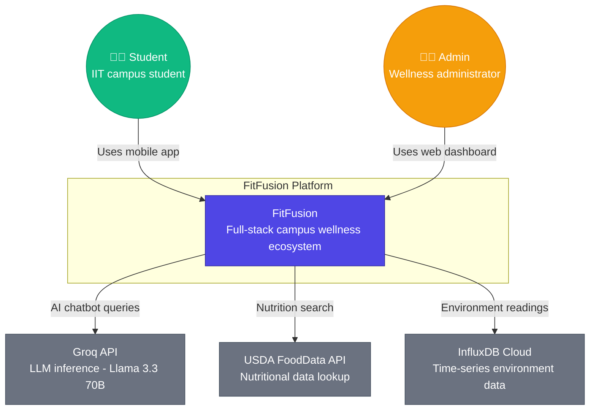

---

### 1.2 Component Diagram

Internal architecture of the FitFusion backend system.

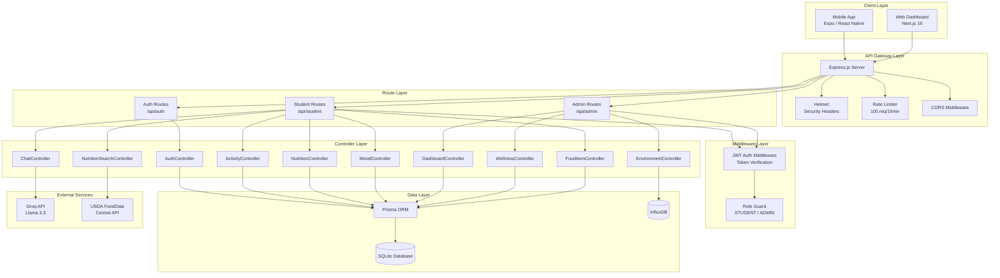

---

### 1.3 Deployment Diagram

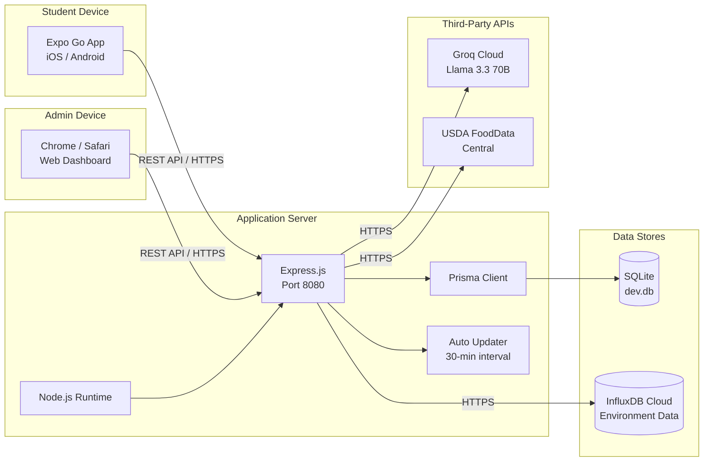

---

### 1.4 Use Case Diagram

```mermaid
graph TB
    subgraph "Student Use Cases"
        UC1[Register / Login]
        UC2[Log Activity]
        UC3[View Activity History]
        UC4[Log Meal / Nutrition]
        UC5[Search Food Nutrition]
        UC6[Mood Check-in]
        UC7[Write Journal Entry]
        UC8[Chat with AI Bot]
        UC9[View Profile]
        UC10[Update Profile]
    end

    subgraph "Admin Use Cases"
        UC11[View Dashboard Analytics]
        UC12[Manage Users]
        UC13[View Nutrition Analytics]
        UC14[View Activity Analytics]
        UC15[Manage Wellness Events]
        UC16[Monitor Environment Zones]
        UC17[Generate Reports / CSV Export]
    end

    STUDENT((Student))
    ADMIN((Admin))

    STUDENT --> UC1
    STUDENT --> UC2
    STUDENT --> UC3
    STUDENT --> UC4
    STUDENT --> UC5
    STUDENT --> UC6
    STUDENT --> UC7
    STUDENT --> UC8
    STUDENT --> UC9
    STUDENT --> UC10

    ADMIN --> UC1
    ADMIN --> UC11
    ADMIN --> UC12
    ADMIN --> UC13
    ADMIN --> UC14
    ADMIN --> UC15
    ADMIN --> UC16
    ADMIN --> UC17
```

---

## 2. Low-Level Design (LLD)

### 2.1 Class Diagram — Domain Models

Object-oriented representation of the Prisma schema entities and their relationships.

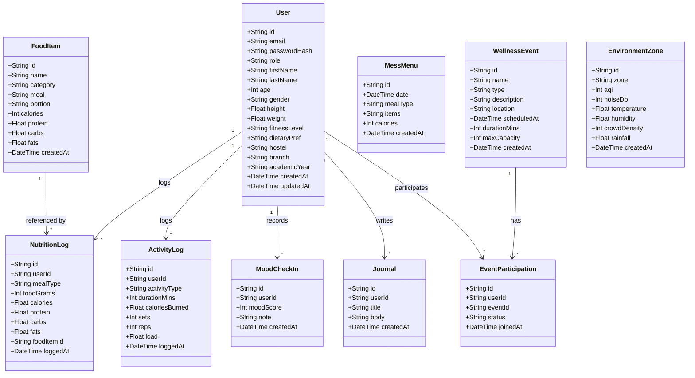

---

### 2.2 Class Diagram — Controllers & Services

Backend controller responsibilities and dependencies.

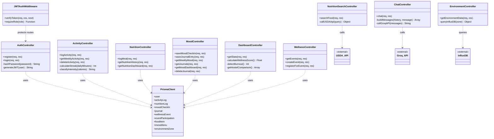

---

### 2.3 ER Diagram

Entity-Relationship diagram for the SQLite database.

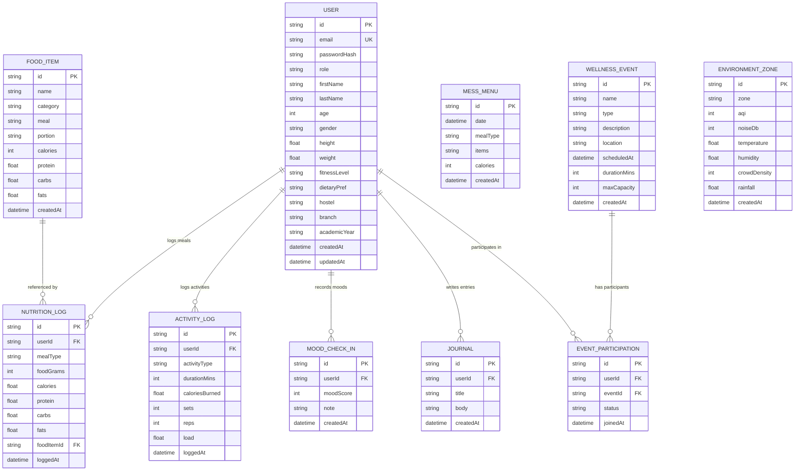

---

### 2.4 Sequence Diagrams

#### 2.4.1 User Registration & Login

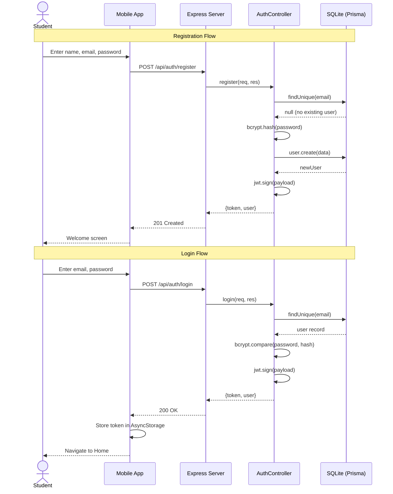

---

#### 2.4.2 Activity Logging Flow

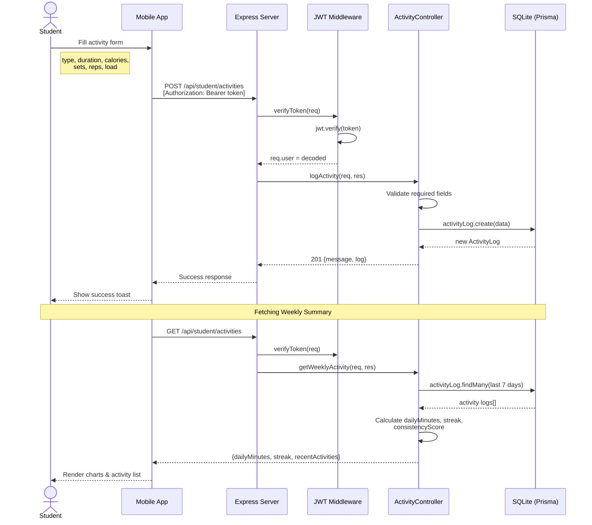

---

#### 2.4.3 AI Chatbot Interaction

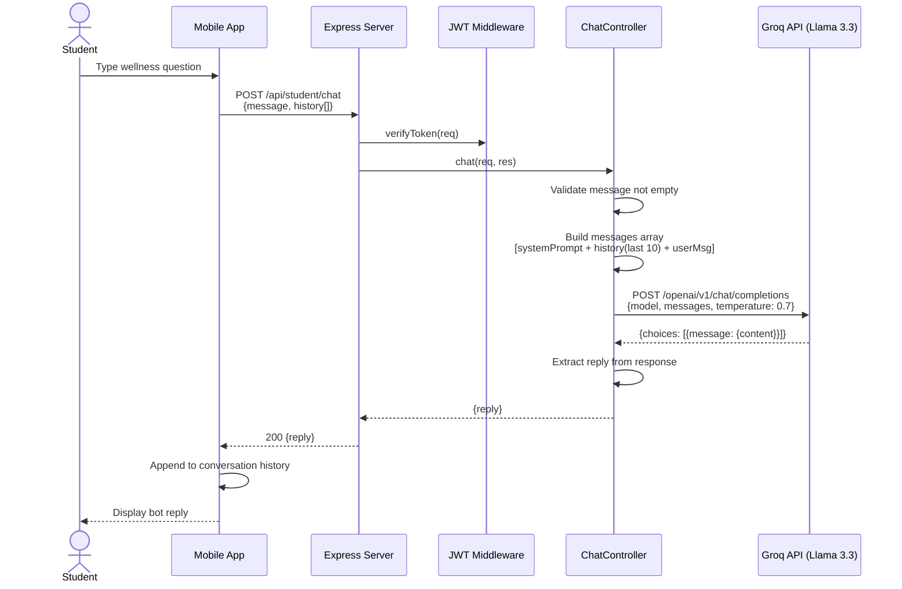

---

#### 2.4.4 Nutrition Search & Meal Logging

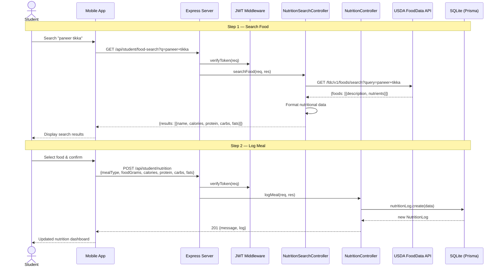

---

#### 2.4.5 Mood Check-in & Journaling

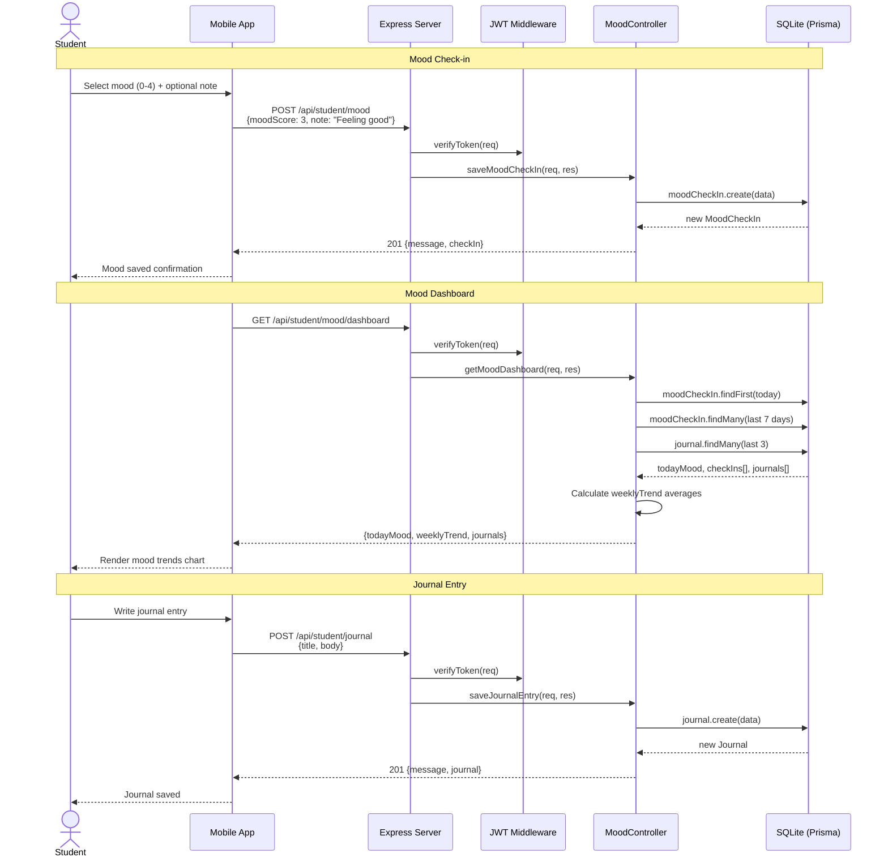

---

#### 2.4.6 Admin Dashboard Analytics

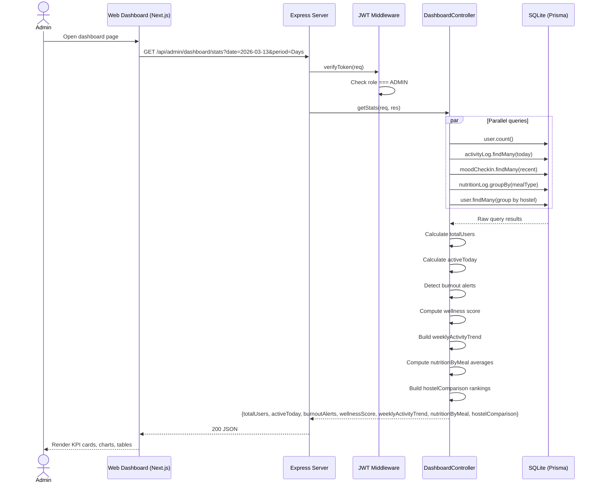

---

#### 2.4.7 Environment Monitoring

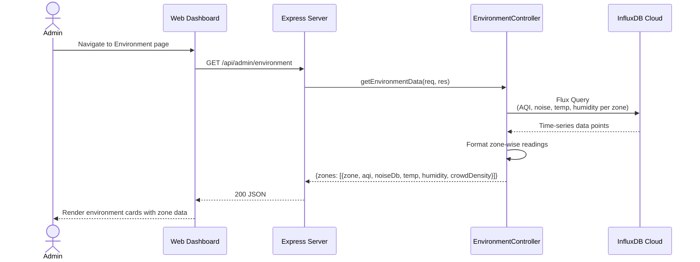

---

*Document generated for the FitFusion Campus Wellness Ecosystem project.*
